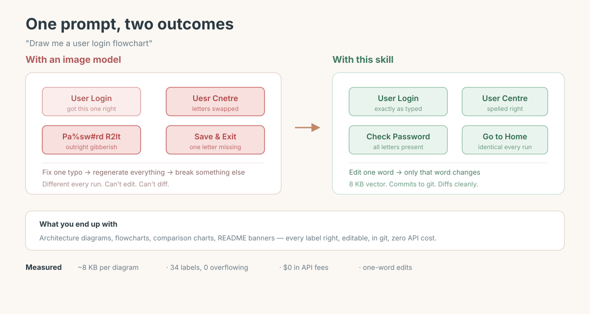

# SVG Infographic

[中文](./README.md)

**Diagrams from your coding agent — no image model needed.**

Architecture diagrams, flowcharts, comparison charts, README banners. Every label spelled right, clean vectors, ~8 KB per file.

Ask for a diagram, get a diagram:



## Sound familiar?

You ask an AI for an architecture diagram. It looks great — **except the labels are wrong.** "User Center" becomes "User Centar", or turns into gibberish entirely.

Chinese is worse. Want to fix a typo? Regenerate the whole thing, and **something else breaks this time.**

And an infographic is 100% about its words. Wrong words, dead image — no matter how good it looks.

This skill takes a different route: **it doesn't draw the picture, it writes SVG.**

So every word is the word you wrote.

## What you get

| | Image-gen AI | With this |
|---|---|---|
| **Needs an image model** | Yes, it's the premise | **No** |
| Text accuracy | Often misspells, worse in Chinese | **100% yours** |
| Change one word | Regenerate everything | Edit one line |
| File size | Hundreds of KB to MBs | **~8 KB, vector** |
| Style consistency | Drifts every run | Identical every time |
| Diffable in git | ❌ Binary | ✅ Text |
| API key / cost per image | Required, paid | **Neither** |

One side effect: **it doesn't guess.** Before a diagram ships, it gets measured — label overflow, blank regions, colour drift. Most models can't see their own output, so measuring is the only honest check.

Real output:

```
Labels overflowing the canvas   0 of 31
Stray colours                   none (a parse error renders as pink blocks)
Blank regions                   none (7/7 bands have content)
File size                       135 KB → 46 KB, no visible colour shift
Renders on GitHub               yes (1800 × 960 loaded)
```

## When to use it

- **Labels must be right** — architecture diagrams, flowcharts, comparison charts, README banners
- **You'll want to edit** — change one label, not the whole picture
- **It belongs in git** — vector, text, diffable

Skip it for:

- Illustrations, mood shots, photorealism → use an image model
- Pure logic diagrams where layout doesn't matter → use Mermaid, GitHub renders it free

## Install

Drop `SKILL.md` into your agent's skills directory:

```bash
# pi
mkdir -p ~/.pi/agent/skills/svg-infographic
cp SKILL.md ~/.pi/agent/skills/svg-infographic/

# Claude Code (project-level)
mkdir -p .claude/skills/svg-infographic
cp SKILL.md .claude/skills/svg-infographic/
```

Requirements:

```bash
Google Chrome              # render, screenshot, measure text bounds
python3
pip install pillow numpy   # pixel analysis + PNG compression
```

Then just tell your agent:

- "draw an architecture diagram for this README"
- "make a flowchart explaining this"
- "make a before/after comparison chart"
- 「给这个 README 画张架构图」

## What's in here

```
SKILL.md                      the methodology
scripts/
  svg2png.sh                  SVG → PNG (Chrome headless + Pillow)
  check_overflow.py           detect text overflow
  check_pixels.py             ink coverage, luminance, blank bands
  check_colors.py             detect parse errors (misused HTML entities)
references/
  dark-template.html          dark HTML template with export buttons
assets/                       example diagrams
```

Hard-won rules and pitfalls (CLI flags, font stacks, compression, palette) live in [`RULES.md`](RULES.md). For publishing (multi-language, image pairing), see the [`github-release`](https://github.com/MoeWang-ys/github-release) skill.

## Credits

- Structure techniques absorbed from [Cocoon-AI/architecture-diagram-generator](https://github.com/Cocoon-AI/architecture-diagram-generator) (MIT). Its dark-neon palette is not this skill's default.
- `references/dark-template.html` © Cocoon AI, MIT — see `references/dark-template-LICENSE`.
- Palette guardrails from `huashu-design`.

## License

MIT
