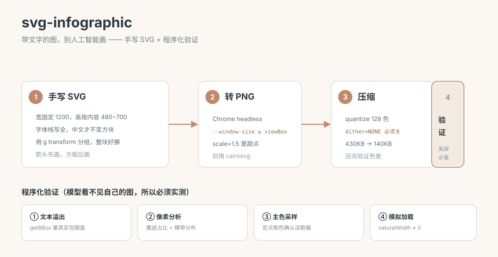

# SVG Infographic

An agent skill for making infographics — architecture diagrams, flowcharts, comparison charts, README banners — as **hand-written SVG**, rendered with Chrome headless.

It's a `SKILL.md`, so any coding agent with filesystem and shell access can use it (Claude Code, pi, Cursor).

Here's a diagram made through the skill — 34 text elements, zero overflow:



## What This Does

**Text accuracy is the whole point of an infographic — and image-generation models are bad at text, especially Chinese.** So this skill doesn't generate images. It writes SVG by hand, then verifies the result programmatically.

| | Image-gen AI | This skill |
|---|---|---|
| Text accuracy | Often misspells — worse in Chinese | **100% yours** |
| Change one word | Regenerate everything | Edit one line |
| File size | Hundreds of KB to MBs | **~8 KB, vector** |
| Style consistency | Drifts every run | Identical every time |
| Version control | ❌ Binary | ✅ Text diff |
| Needs an API key | Yes | **No** |

Use it when **text matters**. Use an image model for illustrations and mood shots. Use Mermaid for pure logic diagrams — GitHub renders it natively for free.

### Key Features

- **Programmatic verification** — overflow detection via `getBBox()`, ink-coverage and luminance analysis, colour sampling, and a GitHub-style load check. This matters because most models can't see their own output.
- **Chrome headless pipeline** — render to PNG and measure real text bounds. No cairo, no `libcairo.2.dylib` nightmares.
- **PNG compression** — 430 KB → 140 KB with a pixel-diff check so you never ship colour drift.
- **Bilingual by default** — Chinese and English layouts measured separately, because English runs wider.
- **Anti-AI-slop palette** — warm sand, terracotta, ink teal. Curated from `huashu-design`'s no-go list (bye-bye, neon-on-navy and purple gradients).
- **Dark template included** — an HTML wrapper with copy / PNG / PDF export buttons.

## Who is this for

Anyone whose coding agent needs to produce a diagram with **accurate labels** — project READMEs, architecture docs, internal explainers. Especially if you work in Chinese.

## Installation

Copy `SKILL.md` into your agent's skills directory:

```bash
# pi
mkdir -p ~/.pi/agent/skills/svg-infographic
cp SKILL.md ~/.pi/agent/skills/svg-infographic/

# Claude Code (project-level)
mkdir -p .claude/skills/svg-infographic
cp SKILL.md .claude/skills/svg-infographic/
```

Requirements:

```bash
Google Chrome              # rendering, screenshots, and measuring text bounds
python3
pip install pillow numpy   # pixel analysis + PNG compression
```

Then just ask: *"draw an architecture diagram for this README."*

## Trigger Phrases

- "给 README 配图"
- "画个架构图" / "做个流程图" / "画张对比图"
- "画图说明一下" / "整个图看看"
- "illustrate this in a diagram" / "make an infographic"

## Repository Layout

```
SKILL.md                      the methodology
scripts/
  svg2png.sh                  SVG → PNG (Chrome headless + Pillow)
  check_overflow.py           text overflow detection
  check_pixels.py             ink coverage, luminance, band analysis
references/
  dark-template.html          dark HTML template with export buttons
assets/                       example diagrams
```

Hard-won rules and pitfalls (pipeline flags, font stacks, compression, palette) live in [`RULES.md`](RULES.md).

## The Verified Numbers

Every figure below is output from the scripts in this repo.

```
Text overflow      34 texts, 0 overflowing
Ink / luminance    2.89% coverage, darkest 56 (text rendered)
Band analysis      6/6 horizontal bands have content
PNG compression    138 KB → 51 KB (-63%), pixel error 0.04/255
GitHub load check  naturalWidth × naturalHeight = 1800 × 930
```

## Credits

- Structure techniques absorbed from [Cocoon-AI/architecture-diagram-generator](https://github.com/Cocoon-AI/architecture-diagram-generator) (MIT). Its dark-neon palette is not this skill's default.
- `references/dark-template.html` © Cocoon AI, MIT — see `references/dark-template-LICENSE`.
- Palette guardrails from `huashu-design`.

## License

MIT
